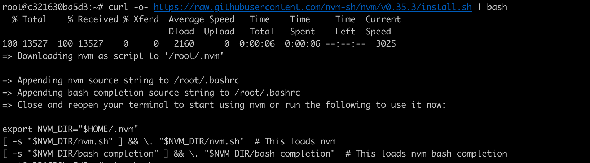

# Installation Guide - Linux

## What You Will Be Installing

1. Microsoft Teams
2. Git and Github
3. Node.js (latest LTS version) and NPM Packages
4. Visual Studio Code (Recommended) and Plugins
5. The React Developer Tools extension, which is supported in Chrome, Firefox, and Microsoft Edge

Before installing anything, update your package manager. Depending on your linux distro, it could be:

```bash
sudo apt update
sudo apt-get update
sudo yum update
```

Many of the installation steps for Linux will be similar to macOS. You can follow the [Mac Installation Guide](InstallationGuideMac.md), with these differences:

#### 1. You will not need to install Xcode or Homebrew

macOS does not come with a package manager out of the box like Linux does. Homebrew is a package manager for Mac, and Xcode is a dependency for Homebrew.

#### 2. You will substitute the command _brew_ with your own operating system's command

For example, if you have Ubuntu, you would replace this command

```bash
brew install git
```

with

```bash
sudo apt-get install git
# You will probably need sudo
```

Depending on your Linux distro, you could be replacing _brew_ with _apt_, _apt-get_, _yum_ or something else.

#### 3. You will need to install Node.js with NVM

We will be using the latest even numbered version of Node.js, and the default Node.js packages are typically a few major versions behind. A command like e.g. `sudo apt-get install -y nodejs` will not get you the latest LTS version. NVM will allow you to install the latest LTS version (20.x as of June 2024).

# Node Version Manager (NVM)

Node Version Manager (NVM) is a version manager for Node.js. That means that it will allow you to manager and install multiple versions of Node.js on your computer. We recommend it if:

- You are working on a Linux machine
- You do not have the latest version of Node.js and you have Node.js projects that you wish to maintain
- You are serious about Node.js development and experienced in working with the command line

This is not for beginners. If you are new to the command line or installing node for the first time, we recommend following the instructions on how to install Nodes.js in the [Mac](InstallationGuideMac.md) or [Windows](InstallationGuideWindows.md) guide.

## If you already have Node.js installed

Write down what version of Node.js you have. You can find this out by typing `node -v`

If you have any existing projects, create a file called _.nvmrc_ your projects' root. Open the file and add your current Node.js version to it. So, for example, if current version of Node.js is 16.15.5 you would type and save the following:

```
v16.15.5
```

Finally, before installing NVM, you will need to uninstall your current version Node.js and NPM. How you uninstall depends on your Operating System and how you installed Node.js. For example:

```bash
# Newer Versions of Ubuntu and Debian
sudo apt remove nodejs
sudo apt purge nodejs
sudo apt autoremove

# Older Versions of Ubuntu
sudo apt-get remove nodejs
sudo apt-get purge nodejs
sudo apt-get autoremove

# macOS with Homebrew
brew uninstall node
```

If you installed Node.js on macOS from the Node.js website, there are many more steps involved. See https://stackabuse.com/how-to-uninstall-node-js-from-mac-osx/

If you have Windows, you can uninstall Node.js from the Control Panel.

## Creating a profile file

NVM writes to something called a "profile file". If you do not have a profile file, you will need create one before installing NVM.

First, see if you already have a profile file. In your terminal, run this command to list all the files in your home directory:

```bash
ls -a ~/
```

Look to see if you have any of the following files. These files are called "profile files".

- .bash_profile
- .bashrc
- .profile
- .zshrc

If you see one of these files below, you already have a profile file, and you can skip ahead to the next section. If you don't see any one of those files, then create one:

```bash
# macOS
touch ~/.zshrc

# Windows with Git Bash
touch ~/.bash_profile
```

If you have Linux, type `zsh --version`. If this returns a version number, create a ".zshrc" file. If this returns an error like "command not found", create a ".bash_profile" file.

## Installing NVM

These instructions to install NVM are for Linux, macOS and Windows with Git Bash. If you have Windows, and do not want to use Git Bash, then install [nvm-windows](https://github.com/coreybutler/nvm-windows) instead.

```bash
curl -o- https://raw.githubusercontent.com/nvm-sh/nvm/v0.39.7/install.sh | bash
```

In your terminal, you should see a success message like the following:



Pay attention to the last few lines, beginning with `export NVM_DIR="$HOME/.nvm"`. You are going to double check that these three lines were added to your profile file. Open your profile file in a text editor. To open in Visual Studio code:

```bash
# macOS
code ~/.zshrc

# Windows with Git Bash
code ~/.bash_profile
```

If you see the `export NVM_DIR="$HOME/.nvm"` ... at the end of the file, then you know that NVM has been added to your path, and you can close the file. If not, you will need to manually add it. Copy all three lines beginning with beginning with `export NVM_DIR="$HOME/.nvm"` and paste them in your profile file. Save and exit.

If you had more than one profile file, you will need to repeat for each file.

Restart your terminal. Type `nvm --version`. You should see a version number like e.g. _0.39.7_.

## Using NVM

You have NVM installed, but you still need to install Node.js. You will need to have the latest LTS version of Node installed as of June 2024 (20.x).

```
nvm install --lts
```

If you are working with NVM because you have older Node.js projects, you can install older versions of Node.js by specificizing the version number. For example, if need version 16.22.0:

```bash
nvm install 16.22.0
```

To switch between node versions, you can specify the version.

```bash
nvm use node # latest version installed
nvm use 16.22.0 # specific version
```

If you have a _.nvmrc_ file in your project root, then you do not need to specify the version number from inside your project.

```bash
nvm use
```

However, `nvm use` will only set the node version in the terminal window that you are working in. When you close your terminal window, it will revert to a default version. Here is how you to set the default version:

```bash
nvm alias default node # latest version installed
nvm alias default 16.22.0 # specific version
```

See more [usage instructions](https://github.com/nvm-sh/nvm#usage) and ["How to Lock down Your Project’s Node Version Using .Nvmrc Or engines"](https://medium.com/@faith__ngetich/locking-down-a-project-to-a-specific-node-version-using-nvmrc-and-or-engines-e5fd19144245).
