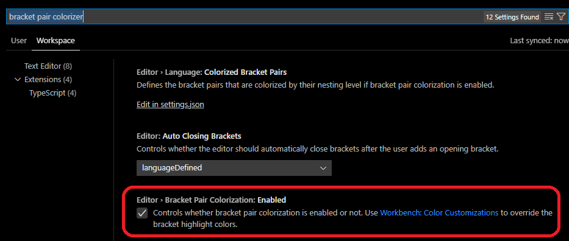

# Installation Guide - Mac

If you are viewing this in Visual Studio Code, press `command + shift + v` to open this in preview mode.

## For Those Who Took the JavaScript Fundamentals Class

If you took the fundamentals class and followed the previous installation guide, you will just need to upgrade a few things and install some Node.js packages.

You will need open your terminal. You can open it by pressing `command+space` and searching for _terminal_. Then run the following commands:

```
brew update
brew upgrade git
brew upgrade node@20
npm install -g npm@latest
npm install -g create-vite@latest
npm install -g eslint@latest
npm install -g eslint-plugin-react
npm install -g eslint-plugin-react-hooks
```

You will also need to install the [_React Developer Tools_](https://react.dev/learn/react-developer-tools). It is available in [Google Chrome](https://chrome.google.com/webstore/detail/react-developer-tools/fmkadmapgofadopljbjfkapdkoienihi?hl=en), [Firefox](https://addons.mozilla.org/en-US/firefox/addon/react-devtools/) and [Microsoft Edge](https://microsoftedge.microsoft.com/addons/detail/react-developer-tools/gpphkfbcpidddadnkolkpfckpihlkkil). (Yes, you can install Microsoft Edge on Mac).

---

## For New Students

This is what you will be installing today:

1. Microsoft Teams
2. Xcode
3. Homebrew
4. Git and Github
5. Node.js (latest LTS version) and NPM Packages
6. Visual Studio Code (Recommended) and Extensions
7. React Developer Tools browser extension

### Microsoft Teams

Before class began, you should have received emails and training from CanCode Communities about on how to install, setup, and use Microsoft Teams.

You will need to give Teams permissions for _Screen Recording_, because we ask students to share their screens during class. See "Turn on Screen Sharing" in [Microsoft's "New Teams for Mac - Overview and prerequisites" article](https://www.marquette.edu/microsoft-teams/teams-macos-access.php) or refer to the "Trainee Success Welcome Guide".

### Xcode

Xcode can be found in the App Store. It will take around 50 minutes to install, so please install ASAP.

Once Xcode is complete, go to your terminal and install the command line tools:

```bash
xcode-select --install
```

### Homebrew

[Homebrew](https://brew.sh/) is a package manager for Mac, meaning that it will help make installing and managing a lot of command line software easier. We will be installing Node.js with Homebrew to avoid permission issues.

To install Homebrew, type this in your terminal:

```bash
/bin/bash -c "$(curl -fsSL https://raw.githubusercontent.com/Homebrew/install/HEAD/install.sh)"
```

Hit enter when the installation prompts you to hit enter. At some point, you may be requested to enter your password. The password is the same password you use to login with your computer.

Once installed, type `brew -v` to confirm that everything worked. As a safe measure, type `brew doctor`. You should see _Your system is ready to brew_.

If you already have homebrew installed, its a good idea to update it. Run `brew update`.

### Git and Github

Git is version control software. It is used for sharing code, combining team members' code and managing different versions of your code.

You will need to [create a Github account](https://github.com/signup?ref_cta=Sign+up&ref_loc=header+logged+out&ref_page=%2F&source=header-home) if you do not have one.

To install git, type this in your terminal:

```bash
brew install git
brew tap microsoft/git
brew install --cask git-credential-manager-core
```

When it's finished, type `git --version` to confirm that it has installed.

If you already have git installed, its a good idea to update it. If you installed with homebrew, run `brew upgrade git`.

### Node.js and NPM Packages

Node.js is a JavaScript runtime engine. It allows you to run JavaScript programs outside of Chrome, Safari, Edge or another web browser.

You will need to have the latest LTS version of Node installed as of June 2024 (20.x). If you already have Node.js installed, type `node -v` in your terminal. If you do not have the latest version, you can do one of the following to things:

1. [Upgrade Node.js with whatever you originally installed Node.js with.](https://flaviocopes.com/how-to-update-node/) If you have Node.js projects on your computer and you wish to maintain them, this could break your existing projects.
2. Install multiple version of Node.js on your computer with NVM. See the _Node Version Manager (NVM)_ section of the [Linux Installation Guide](InstallationGuideLinuxAndNVM.md#node-version-manager-nvm).

If you do not have Node.js installed, type this is your terminal:

```bash
brew install node@20
```

When it’s finished, type `node -v` to confirm that it is now installed.

#### NPM

Update NPM with:

```bash
npm install -g npm@latest
```

#### Vite.js

Vite.js is like a "React start kit." It installs and sets up a React application.

```bash
npm install -g create-vite@latest
```

#### ESLint

ESLint is a linter, meaning that it will point out potential errors in real-time while you are typing in a code editor like Visual Studio Code.

To install ESLint and its React plugins, type:

```bash
npm install -g eslint
npm install -g eslint-plugin-react
npm install -g eslint-plugin-react-hooks
```

When it’s finished, type `eslint -v` in your terminal to confirm it is now installed.

### Visual Studio Code (Recommended) and Extensions

Visual Studio Code is an IDE, which is an intelligent code editor. We will be teaching with Visual Studio Code and highly recommend that you use it too. If you are experienced with programming and the command line, and you believe that you can translate whatever we teach you in Visual Studio Code to your editor of choice, you may opt for another editor, but we will not be able to help you if problems arise.

To install, go to https://code.visualstudio.com and click on the _Download Mac Universal_ dropdown and select the _Stable_ version.

When it finishes downloading, double click on the downloaded ZIP file and move Visual Studio Code from your Downloads folder to your Applications folder. You many need to enter your password.

Open Visual Studio Code.

If you see this security warning at any time during our class, click on _Open_.


#### Adding Visual Studio Code to Your Path Variable

You should configure your computer so that you can open Visual Studio Code via the terminal. Press `command + shift + p`, search for _shell command_ and click on _Shell Command: Install 'code' command in PATH_.


#### Configuring Git to Open in Visual Studio Code

You should have a terminal open in the bottom panel of the screen like this. (If you do not, go to "View" > "Terminal" in the main menu).


Click on it and enter the following:

```bash
git config --global core.editor "code --wait"
git config --global -e
```

Restart Visual Studio Code.

#### ESLint Extension

Open the Extensions tab on the left, search for _ESLint_ and install _ESLint_.


Once its installed, the _Install_ button may have transformed into a _Reload_ button. If you see _Reload_, click on it.

### Bracket Colorization Setting

Bracket Colorization is a simple setting that makes it much easier to debug issues with closes curly braces, brackets, and parentheses. To enable, press `command + shift + p`. Search for _settings_ and click on _Open Settings (UI)_.


Then search for _bracket pair colorizer_. You should see the setting _Editor > Bracket Pair Colorization_. Click on the checkbox to enable it.



#### Prettier Extension (Optional)

Prettier automatically formats your code and you can configure it to format your code whenever you save a file. Using this is optional for now but we will require it for group projects.

If you would like to use prettier, search for _Prettier_ in the Extensions tab on the left and install _Prettier - Code formatter_. Once its installed, click on _Reload_ if necessary.

You can now adjust Visual Studio's settings so that it will format on save and will play nicely with Prettier's defaults. Press `command + shift + p,` search for _settings_ and click on _Preferences: Open Settings (JSON)_.


Paste the following into the JSON file. Do not overwrite any settings that you already have.

```json
  "editor.formatOnSave": true,
  "editor.insertSpaces": true,
  "editor.tabSize": 2,
```

### React Developer Tools Browser Extension

You are required to use Chrome, Firefox, or Microsoft Edge because the [_React Developer Tools extension_](https://react.dev/learn/react-developer-tools) for debugging your code are only available on these browsers. We recommend Chrome because we will be demonstrating Chrome's tools in class.

- [React Developer Tools for Chrome](https://chrome.google.com/webstore/detail/react-developer-tools/fmkadmapgofadopljbjfkapdkoienihi?hl=en)
- [React Developer Tools for Firefox](https://addons.mozilla.org/en-US/firefox/addon/react-devtools/)
- [React Developer Tools for Microsoft Edge](https://microsoftedge.microsoft.com/addons/detail/react-developer-tools/gpphkfbcpidddadnkolkpfckpihlkkil) (Yes, you can install Microsoft Edge on Mac.)
