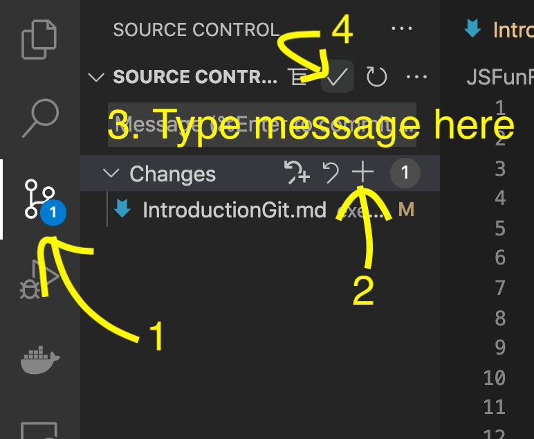
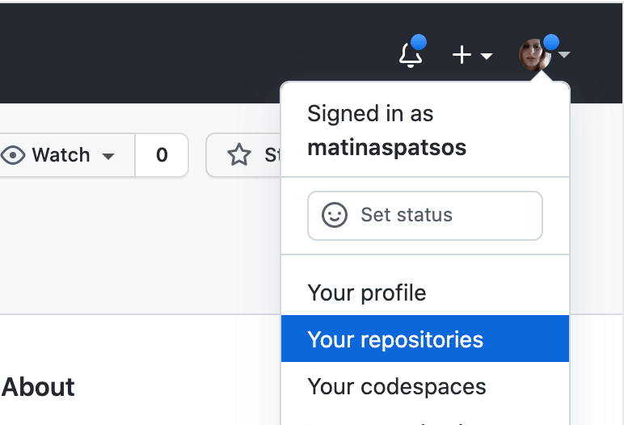
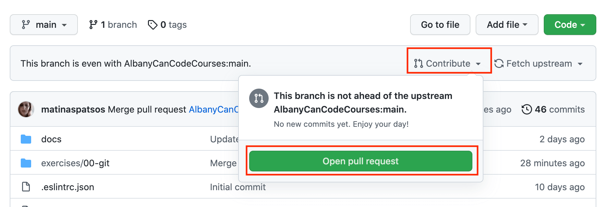

# Submitting Your Assignments

## Step 1: Save your files on your local computer

## Step 2: Commit your changes to Git

You will first need to commit your changes to your local machine. To do this in visual studio code:

1. Click on the _Git_ icon in the sidebar.
2. Hover over changes and click on the plus icon. (Or hover over each file that you want to commit and click on the plus icon.)
3. Give your commit a descriptive name where it says "Message ..."
4. Click on the checkmark icon above your message.



## Step 3: Push your Changes to your forked repository

In your terminal (in Visual Studio Code), type:

```
git push origin main
```

## Step 4: Make a pull request

You will then need to make pull request from Github if you do not have one already. Here is how you will do that:

1. Open a browser (Chrome, Edge, Safari, Firefox, etc) and go to https://github.com/
2. If you are not signed in, signin
3. In the top right, click on your avatar and select "Your repositories"



4. Select _JSFrameworks2024_
5. Click on the "Contribute" dropdown and click on the "Open pull request" button



6. Click on the "Create pull requests" button
7. Give your pull request a title if it does not have one and click on the "Create pull requests" button
