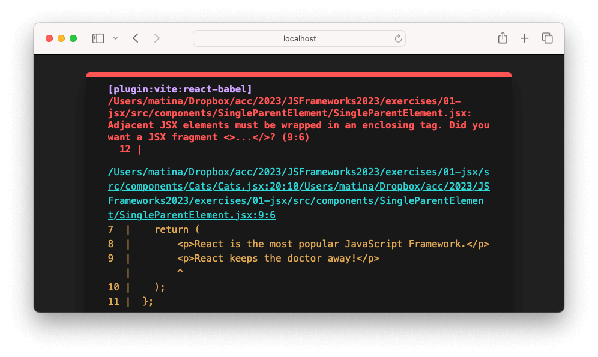
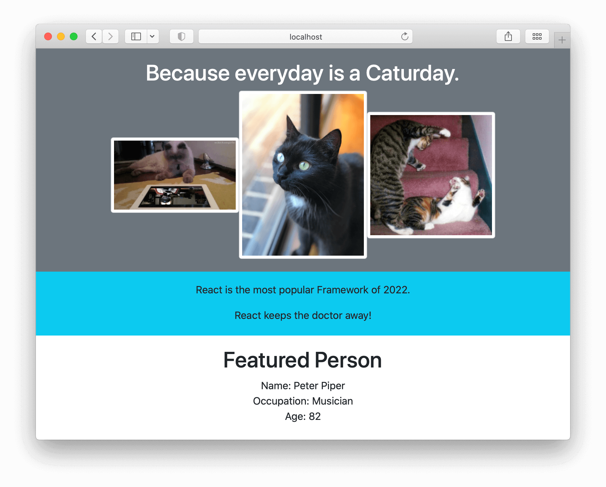

# JSX (React) Exercises

In Visual Studio code, press `command+shift+v` (Mac) or `ctrl+shift+v` (Windows) to open a Markdown preview.

## Getting Started

Using your command line, you will need to navigate to the this folder, install all dependencies, and start the app.

```shell
cd exercises/01-jsx/
code . # if you would like to open this in a separate VS Code window
npm install
npm run dev
```

When you start the application, you should see errors on your screen.



This is because your first assignment will be to fix the errors within _src/components/Cats/Cats.jsx_ and _src/components/SingleParentElement/SingleParentElement_.

To stop the application, press `ctrl+c`.

To run the tests:

```shell
npm run test
```

If you do not see any test results, press `a` to run all tests. The tests will rerun whenever you make a change.

To stop the tests, press `ctrl+c`.

## Assignment 1

Fix the errors within _src/components/Cats/Cats.jsx_ and _src/components/SingleParentElement/SingleParentElement.jsx_.

### Acceptance Criteria

_What is an acceptance criteria?_ In software development, the acceptance criteria defines the conditions that a single "story" or feature must met in order for a feature to be considered complete.

Instead of errors, you should see a list of cats and "React is the most popular JavaScript Framework." appear on the screen.



## Assignment 2

Follow the instructions inside of _src/components/Person/Person.jsx_.

### Acceptance Criteria

Break out of JSX and plugin values from the `person` object inside of `Person.jsx` to complete this assignment.

- The Person component should display the person's name (Peter Piper).
- The Person component should display the person's occupation (Musician).
- The Person component should display the person's age on the screen (84). This should come from a result from a function that calculates the person's age.

# Assignment 3

Create a component called _Me_. It should be in its own separate file and it should contain the text:

> My name is

Import _Me_ in file _src/App.jsx_ and render it to the screen.

### Acceptance Criteria

- You should have a component called _Me_ in its own separate file.
- It should render _My name is_ on the screen.
