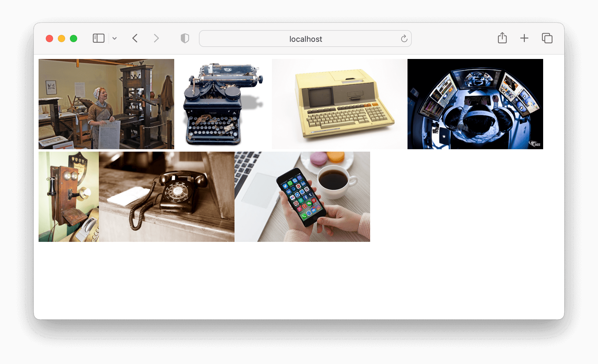

# Rendering Items in an Array

In Visual Studio code, press `command+shift+v` (Mac) or `ctrl+shift+v` (Windows) to open a Markdown preview.

## Getting Started

Using your command line, you will need to navigate to the this folder, install all dependencies, and start the app.

```bash
cd exercises/02-collections/
code . # if you would like to open this in a separate VSCode window
npm install
npm run dev
```

To stop the application, press `ctrl+c`.

To run the tests:

```shell
npm run test
```

If you do not see any test results, press `a` to run all tests. The tests will rerun whenever you make a change.

To stop the tests, press `ctrl+c`.

## Developer Instructions

1. Import the _technologies.js_ and _phones.js_ files from the image directory into the `<App />` component.
2. Iterate over both collections and render each image and render them to the screen.

## Example



## Image Credits

- ["Printing Press, Declaration of Independence, Boston Mass"](https://search.creativecommons.org/photos/844b7232-1876-4746-9294-527c101c6de0) by dog97209 is licensed with CC BY-NC-ND 2.0. To view a copy of this license, visit https://creativecommons.org/licenses/by-nc-nd/2.0/
- ["Forgotten Typewriter"](https://search.creativecommons.org/photos/52e765c1-869d-428f-ae5a-99d6102b18ca) by petesimon is licensed with CC BY 2.0. To view a copy of this license, visit https://creativecommons.org/licenses/by/2.0/
- ["Hewlett-Packard Model 85 Personal Computer"](https://search.creativecommons.org/photos/0dd6fd7a-0d3d-4110-a390-d37046d27c09) by dvanzuijlekom is licensed with CC BY-SA 2.0. To view a copy of this license, visit https://creativecommons.org/licenses/by-sa/2.0/
- ["Hard at work 6/365"](https://search.creativecommons.org/photos/b878e4d7-47b3-4223-9981-7f9304b6086f) by Louish Pixel is licensed with CC BY-NC-ND 2.0. To view a copy of this license, visit https://creativecommons.org/licenses/by-nc-nd/2.0/
- ["Antique wall phone"](https://www.flickr.com/photos/91994044@N00/43826086661) by quinet is licensed under CC BY 2.0. To view a copy of this license, visit https://creativecommons.org/licenses/by/2.0/?ref=openverse.
- ["Rotary Phone in Ti Couz"](https://www.flickr.com/photos/36039505@N00/1436934834) by Clemson is licensed under CC BY 2.0. To view a copy of this license, visit https://creativecommons.org/licenses/by/2.0/?ref=openverse.
- ["Set programs social networking Young girl using smart phone,Social media concept. - Credit to https://www.lyncconf.com/"](https://www.flickr.com/photos/156259214@N05/29532846248) by nodstrum is licensed under CC BY 2.0. To view a copy of this license, visit
