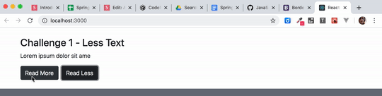

# State Challenge

In Visual Studio code, press `command+shift+v` (Mac) or `ctrl+shift+v` (Windows) to open a Markdown preview.

## Reason for the Challenges

Managing state is often a source of headache for many developers. In these next few challenges will help you improve your ability to manage your app's state.

## Getting Started

Using your command line, you will need to navigate to the this folder, install all dependencies, and start the app.

```bash
cd exercises/05-state/
code . # if you would like to open this in a separate VSCode window
npm install
npm run dev
```

To stop the application, press `ctrl+c`.

To run the tests:

```shell
npm run test
```

If you do not see any test results, press `a` to run all tests. The tests will rerun whenever you make a change.

To stop the tests, press `ctrl+c`.

## Challenge 1

As a user, I would like to be able to truncate text.

### Instructions:

1. Create a component named "LessText" and it should accept two props.
2. Import and display your "LessText" component inside of _exercises/05-state/src/App.jsx_.
3. The first prop should be named "text" and it should accept a string.
4. The second prop should be named "maxLength" and it should accept an integer.
5. Create "Read More" and "Read Less" buttons, which should toggle text based on the "maxLength".

### Acceptance Criteria

The component should have two buttons. The first button should say "Read More". The second button should say "Read Less".

The "Read More" button should display the entire text. The "Read Less" button should truncate the set by the "maxLength" prop.

You must use the `useState()` hook to solve this problem.



## Challenge 2

As a user, I would like to click on a button to role a dice.

### Instructions

Before beginning this exercise, open and review the code inside of _src/components/DiceRoll/DiceRoll.jsx_. Try refreshing the screen. Notice how it displays a different and random image each time. What you are going to do is to make the "Roll" button functional. Read the comments for clues on how to do this.

### Acceptance Criteria

When the user clicks on the "Roll" button, it should "roll the dice". This means that it selects a number between 1 and 6 at random and then update the dice image to have the new number of dots.

You must use the `useState()` hook to solve this problem.
