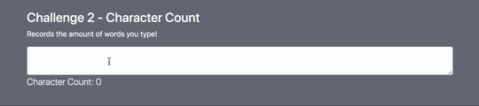
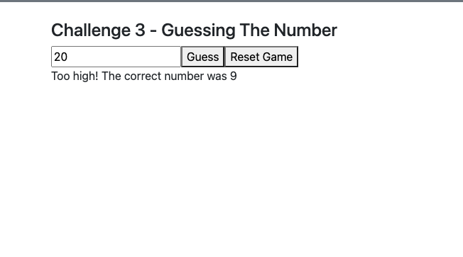

# State with Text Inputs Challenge

In Visual Studio code, press `command+shift+v` (Mac) or `ctrl+shift+v` (Windows) to open a Markdown preview.

## Reason for the Challenges

Much of web development is working with forms. In this exercise, you will learn how to work with user input in React. You will handle text from textboxes.

## Getting Started

Using your command line, you will need to navigate to the this folder, install all dependencies, and start the app.

```bash
cd exercises/06-state/
code . # if you would like to open this in a separate VSCode window
npm install
npm run dev
```

To stop the application, press `ctrl+c`.

To run the tests:

```shell
npm run test
```

If you do not see any test results, press `a` to run all tests. The tests will rerun whenever you make a change.

To stop the tests, press `ctrl+c`.

## Challenge 1

As a user, I would like to see the number of keystrokes a user types displayed on the screen.

### Instructions:

1. Create a component named "CharacterCount". (It will not require any props.)
2. Import and display your "CharacterCount" component inside of _exercises/05-state/src/App.jsx_.
3. It will render a `<textarea>` textbox that will capture user input.
4. It will then render count of the number of characters in the textbox on the screen.

### Acceptance Criteria

You must display the character count to the screen.

You must use the `useState()` hook to solve this problem.



## Challenge 2

As a user, I would like to play a simple number guessing game.

### Instructions:

1. Create a component named "GuessTheNumber". Import and display your "GuessTheNumber" component inside of exercises/05-state/src/App.jsx.
2. It will render an input field for the user to enter a guess, which should be a number between 1 and 10.
3. The input field must validate the entered value. If the user enters an empty input, a 0, or a number outside the range of 1-10, an error message should be displayed prompting them to enter a valid number.|
4. The "GuessTheNumber" component should pick a number between 1 and 10 at random.
5. It will also render a "Submit Guess" button, which, when clicked, will evaluate the user's guess and display a message. The game randomly selects a number between 1 and 10 at the start. If the user's guess is too low, a message saying "Too low! The correct number was [number]" will appear. If the user's guess is too high, a message saying "Too high! The correct number was [number]" will appear. If the user's guess is correct, a message saying "Correct! You win!" will appear.

### Acceptance Criteria

The user is able to input a number between 1 and 10 and submit their guess.

The input field validates the user's input and ensures it's a number between 1 and 10. If the input is invalid (empty, 0, or outside the range of 1-10), an error message is displayed.

If the guess is too low or too high, the correct number is revealed in the feedback message.

If the guess is correct, a message indicating the user's victory is displayed.

You must use the `useState()` hook to solve this problem.

You must use _controlled inputs_ to solve this problem.


