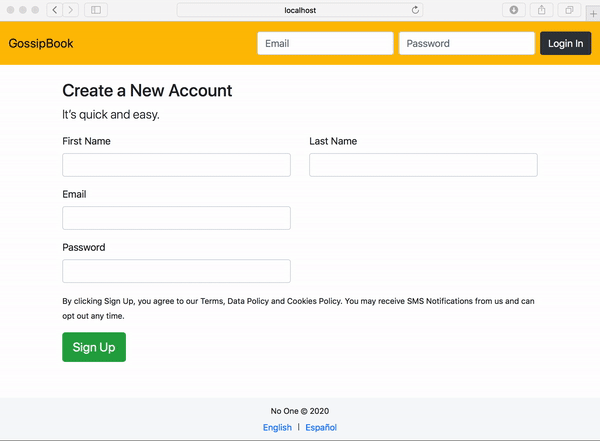

# Context API Challenge 2 - Nested Components

In Visual Studio code, press `command+shift+v` (Mac) or `ctrl+shift+v` (Windows) to open a Markdown preview.

## Reasons for the Challenge

In most real world scenarios, React applications have a hierarchy of components. The Context API is used to share state between many of the components within this hierarchy. This exercise takes what you completed in the first challenge and spreads it out between multiple nested components.

### Examples

Here are some examples of using the Context API across multiple files and components:

- https://codesandbox.io/s/xmo1j8l5z?fontsize=14&hidenavigation=1&theme=dark
- https://codesandbox.io/s/usecontext-v36ew?fontsize=14&hidenavigation=1&theme=dark

## Getting Started

Using your command line, you will need to navigate to the this folder, install all dependencies, and start the app.

```bash
cd exercises/11-context-api/
code . # if you would like to open this in a separate VSCode window
npm install
npm run dev
```

## User Stories

As a user, I would like to click a button to switch the language between English ("en") and Spanish ("es").



As an engineer, I need a way to share the application's current language to all of the components in my application that need to be translated.

## Acceptance Criteria

- You must use the Context API to store the language locale ("en" or "es").
- The "CreateAccount", "Login", "Footer" and "Languages" components must get their state from the Context API.
- When the user clicks on "English" or "Spanish" in the footer, it should change all the copy inside of the "CreateAccount", "Login" and "Footer" components to the desired language.

Note that you do not need to make the forms functional.

## Instructions

You will be storing both the application's language locale ("en" or "es") and the callback to update the language (e.g. "setLanguage") within the Context API.

Take a look at _src/contexts/TranslatorContext.js_. This initializes "TranslatorContext" with `createContext()`. Every file that makes use of the Context API will need to import "TranslatorContext" from this file. You will need to setup the "TranslatorProvider" in this file.

Import the "TranslatorProvider" and wrap it around everything within _src/components/App/App.jsx_.

Open _src/components/CreateAccount/CreateAccount.jsx_. You will need to use `useContext()` to get the current language locale ("en" or "es") and the list of translations for the current language. Repeat for _src/components/Footer/Footer.jsx_ and _src/components/Login/Login.jsx_.

The component "Languages" contains the buttons that, when clicked, will change the current language. Inside of _src/components/Languages/Languages.jsx_, you will need `useContext()`. You will also need to attach event handlers to the buttons that will update the language.
