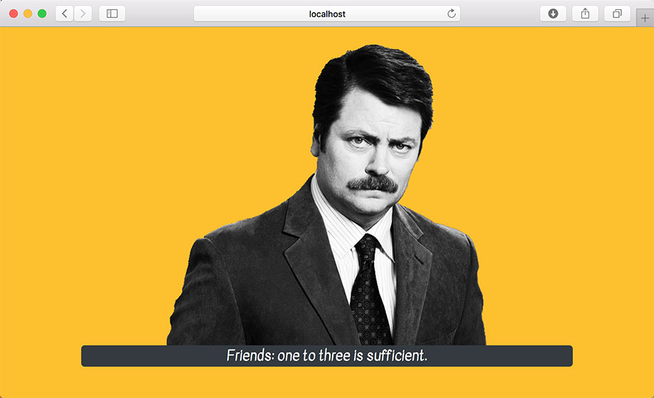

# Effects Challenge 1 - AJAX Request On Mount

In Visual Studio code, press `command+shift+v` (Mac) or `ctrl+shift+v` (Windows) to open a Markdown preview.

## Reason for the Challenge

As Front-End Engineers, we often have to work with APIs, so that we can communicate with a back-end. For example, we can use APIs to store content, modify content, display content on the screen and integrate with third-party services. Understanding the useEffect hook will enable you to make AJAX requests to different APIs.

## Getting Started

Using your command line, you will need to navigate to the this folder, install all dependencies, and start the app.

```bash
cd exercises/12-use-effect/
code . # if you would like to open this in a separate VSCode window
npm install
npm run dev
```

If, at any time, you need to stop the app, press `ctrl+c`.

## User Stories

As a user, I want to see a Ron Swanson quote immediately on my screen.

As a user, I want to see feedback if the quote is loading or if there is an error.



## Acceptant Criteria

- The application should make AJAX request to the _Ron Swanson Quote_ inside the useEffect hook immediately after the component first renders to a Ron Swanson quote.
- It should display a Ron Swanson quote on the screen.
- It should display some kind of loading message or feedback when an AJAX request is loading.
- It should display an error message if there as error making the AJAX request.

## Instructions

Before doing this exercise, read the documentation for the [Ron Swanson Quotes API](https://github.com/jamesseanwright/ron-swanson-quotes).

If you would like to use the Axios library, install it with `npm install axios`. (Vite.js doesn't come with the Axios library, so you will need to install it separately.) Alternatively, you can use the browser native Fetch API.

Complete the instructions in [App.jsx](src/App.jsx).
