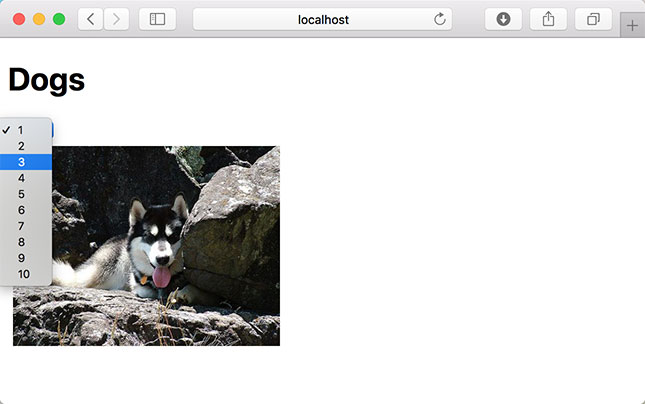
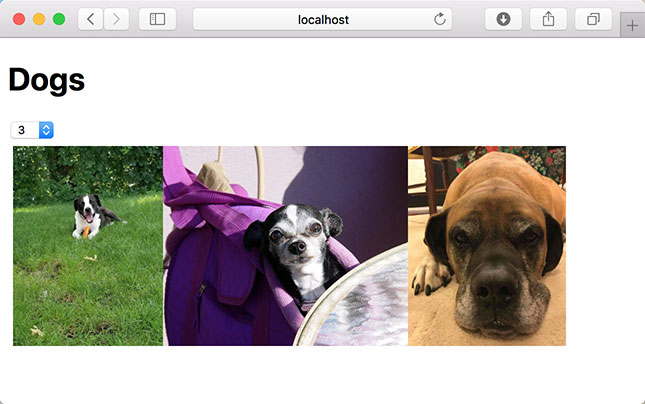

# Effects Challenge 2 - Making AJAX Requests On Update

In Visual Studio code, press `command+shift+v` (Mac) or `ctrl+shift+v` (Windows) to open a Markdown preview.

## Reason for the Challenge

As Front-End Engineers, we often have to work with APIs, so that we can communicate with a back-end. For example, we can use APIs to store content, modify content, display content on the screen and integrate with third-party services. Understanding the useEffect hook will enable you to make AJAX requests to different APIs.

## Getting Started

Using your command line, you will need to navigate to the this folder, install all dependencies, and start the app.

```bash
cd exercises/13-use-effect/
code . # if you would like to open this in a separate VSCode window
npm install
npm run dev
```

If, at any time, you need to stop the app, press `ctrl+c`.

## User Stories

As a user, I would like to be greeted with one random dog image after the screen first loads.

As a user, I should be able to select the number of new random dog images that I want to appear on my screen.





## Acceptance Criteria

- The application should make AJAX requests to the _Random Dog Image API_ inside the useEffect hook.
- You should have dependencies inside your useEffect hook.
- The application should use the useEffect hook at least once.
- Immediately after the component first renders, it should make a request to get one random dog image and display it on the screen.
- When the user selects a number from the dropdown, the application should make another AJAX request and it should display the number of images on the screen that the user selected.

Note that if the user selects, e.g. 5 from the dropdown, you should be making only one AJAX requests, **not** 5 separate AJAX requests.

## Instructions

Before doing this exercise, read the documentation for the [Random Dog Image API here](https://dog.ceo/dog-api/documentation/random#all).

If you would like to use the Axios library, install it with `npm install axios`. (Vite.js doesn't come with the Axios library, so you will need to install it separately.) Alternatively, you can use the browser native Fetch API.

Complete the instructions in [App.jsx](src/App.jsx).
