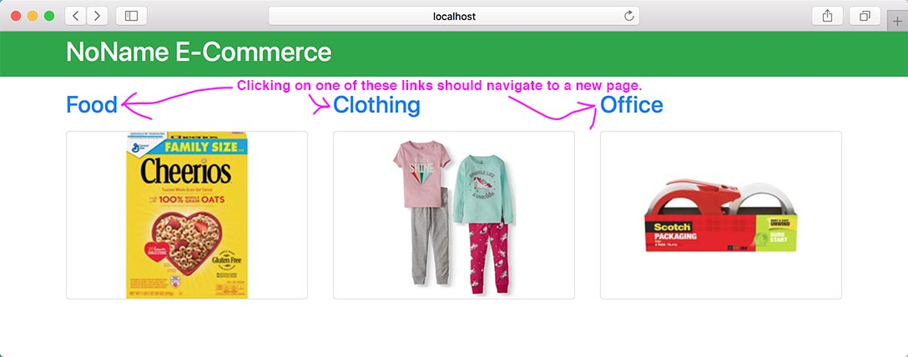
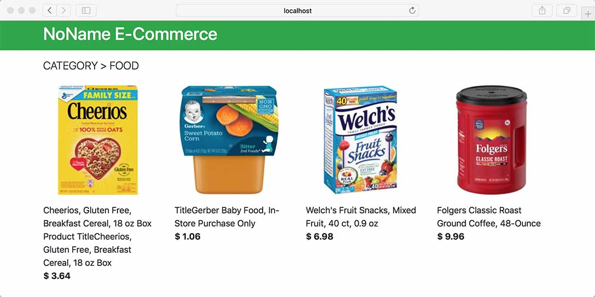

# React Router

In Visual Studio code, press `command+shift+v` (Mac) or `ctrl+shift+v` (Windows) to open a Markdown preview.

## Reasons for the Challenge

Most applications have more than one screen. To control what is seen on the screen when, applications leverage URLs. When a user types in a URL in the address bar, clicks on a link, submits a form, or navigates to a new screen, we need a way to control what React component or components are shown. This is the purpose of React Router, which makes if fairly easy to map a URL to a React component that is rendered onto the screen.

### Examples and Documentation

- https://stackblitz.com/edit/vitejs-vite-7i9qzs?file=src%2Fmain.tsx
- https://blog.logrocket.com/react-router-v6-guide/

## Getting Started

Using your command line, you will need to navigate to the this folder, install all dependencies, and start the app.

```bash
cd exercises/16-react-router/
code . # if you would like to open this in a separate VSCode window
npm install
npm run dev
```

## User Stories

You will be building an E-Commerce site.

As a user, I would like to select a category of products and see all the products in that category.





As a user, I expect my browser's back and forward buttons to work.

As a user, I would like to type a URL into the address bar to navigate to a given screen in the E-Commerce website.

## Acceptance Criteria

| Route                                   | Component | Content Description                                             |
| --------------------------------------- | --------- | --------------------------------------------------------------- |
| http://localhost:5173/                  | Home      | Displays a list of categories - "Food", "Clothing" and "Office" |
| http://localhost:5173/category/food     | Category  | Display all the products in "Food"                              |
| http://localhost:5173/category/clothing | Category  | Display all the products in "Clothing"                          |
| http://localhost:5173/category/office   | Category  | Display all the products in "Office"                            |

- When the user types ones of the routes in the table above into an address bar, the application should render the matching component and display the associated content.
- When the user clicks on one of the "Food", "Clothing" or "Office" links on the Home screen, it should map to the Category component, and it should display the content for the category that they clicked on.
- Clicking on a link should not refresh the page.
- The user should be able to navigate with the back and forward buttons in his or her browser.
- You should leverage the `<Route>` component only two times.

## Instructions

Before you begin, you will need to install React Router.

```shell
npm install react-router-dom
```

You will need to edit each one of these in this exact order. Each file will have comments describing what you need to do.

1. src/main.tsx
2. src/components/App/App.tsx
3. src/components/Home/Home.tsx
4. src/components/Category/Category.tsx
