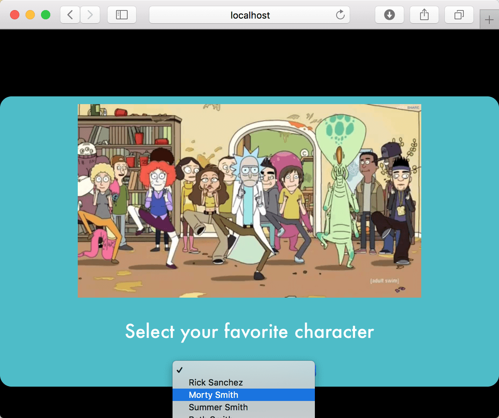

# Tanstack Query

In Visual Studio code, press `command+shift+v` (Mac) or `ctrl+shift+v` (Windows) to open a Markdown preview.

## Reason for the Challenge

As front-end engineers, interacting with APIs is a fundamental skill. APIs allow us to communicate with back-end services, enabling functionalities like storing, modifying, and displaying data. In this challenge, we will leverage the power of Tanstack Query to manage API requests efficiently. Tanstack Query simplifies data fetching, caching, synchronization, and error handling, allowing developers to focus on building features rather than managing server state.

Tanstack Query provides several advantages:

- _Automatic Caching_: Tanstack Query caches API responses, reducing redundant network requests.
- _Background Refetching_: Data can be refreshed in the background, ensuring users always see up-to-date information.
- _Simplified State Management_: It eliminates the need to manually handle loading and error states, making the code cleaner and easier to maintain.

This challenge will guide you through using Tanstack Query to fetch data from an API, cache the results, and update the UI based on user interactions.

## Examples

- [Quick Start](https://tanstack.com/query/latest/docs/framework/react/quick-start)
- [A Simple Example](https://tanstack.com/query/latest/docs/framework/react/examples/simple)
- [Rick and Morty Example](https://tanstack.com/query/latest/docs/framework/react/examples/rick-morty)

## Getting Started

Using your command line, you will need to navigate to this folder, install all dependencies, and start the app.

```bash
cd exercises/19-tanstack-query
code . # if you would like to open this in a separate VSCode window
npm install
npm run dev
```

## User Stories

Note that for this exercise, you will be redoing an earlier _useEffect_ assignment (the Rick and Morty exercise). However, for this assignment, you will use _Tanstack Query_ in the place of _useEffect_.

As a user, I want to select a Rick and Morty from a list of characters so that I can see the character's name and what he or she looks like.



Also note that this is "Part 1" of the Tanstack Query exercise, where you will focus on populating the dropdown. In Part 2, you will make the dropdown functional.

## Acceptance Criteria

- The application should make AJAX requests to the Rick and Morty API.
- The application should use Tanstack Query's _useQuery_ hook to fetch data.
- When the component first renders, it should get a list of characters and display their names in a dropdown.
- The application should handle loading and error states gracefully, showing appropriate messages when data is being fetched or if an error occurs.

## Instructions

Before doing this exercise, check out your code for the previous _14-use-effect_ exercise or review the previous exercise's solutions. You may also want to take another look at the documentation for [getting all Rick and Morty characters](https://rickandmortyapi.com/documentation/#get-all-characters).

Next, you will need to install Tanstack Query and, optionally, axios.

```bash
# Axios is optional
npm install @tanstack/react-query axios
```

Wrap your application with _QueryClientProvider_ in index.js the entry point of your app (_src/main.tsx_). Create a _QueryClient_ instance and provide it to your _QueryClientProvider_.

In _src/App.jsx_, use _useQuery_ to fetch the list of characters when the component first renders. Display the characters' names in a dropdown.

Do not do anything more than populate the dropdown. In a later "Part 2" of this exercise, you will work on making it so that when the user selects a character from the dropdown, the character's information displays on the screen.

Show a "Loading..." message while data is being fetched. Display an error message if the API request fails.
