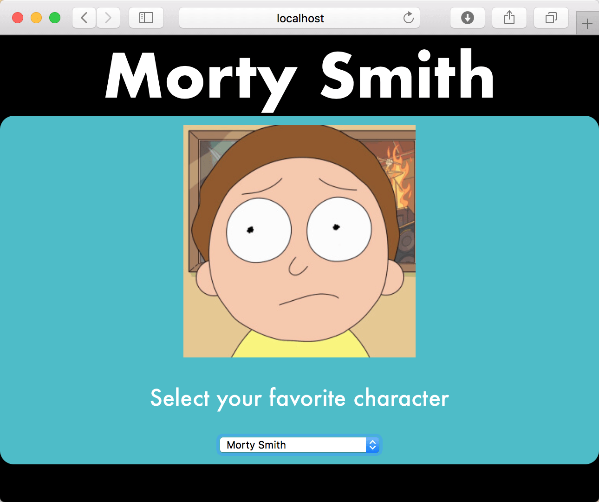

# Tanstack Query - Caching

In Visual Studio code, press `command+shift+v` (Mac) or `ctrl+shift+v` (Windows) to open a Markdown preview.

## Getting Started

This exercise is a "Part 2" for Tanstack Query. You will continue to write your code inside of _exercises/19-tanstack-query_. In the exercise, you will focus on caching.

## User Stories

As a user, I want to select a Rick and Morty from a list of characters so that I can see the character's name and what he or she looks like.

## Acceptance Criteria

- The application should make separate AJAX requests to get a list of characters and get the details about a single character.
- The application should use Tanstack Query's _useQuery_ hook to fetch and cache data.
- When the component first renders, it should get a list of characters and display their names in a dropdown. (You completed this in the last exercise.)
- When a user selects a character from the dropdown, the application should fetch more information on that character using Tanstack Query. When the request finishes, the character's name and image should appear on the screen.
- The results should be cached. In other words, if the user selects the same character again, it should load instantly without making another network request.
- The application should handle loading and error states gracefully, showing appropriate messages when data is being fetched or if an error occurs.

## Instructions

Before doing this exercise, you may also want to take another look at the documentation for [looking up a single Rock and Morty character](https://rickandmortyapi.com/documentation/#get-a-single-character).

To help with debugging caching, you may want to try the Tanstack Query dev tools. See "Install and Import the Devtools" and "Floating Mode" in the [Tanstack dev tool docs](https://tanstack.com/query/latest/docs/framework/react/devtools). Installing this is optional.

Use _useQuery_ to fetch details of the selected character based on the user's choice from the dropdown. Display the character's name and image on the screen.

Show a "Loading..." message while data is being fetched. Display an error message if the API request fails.

Bonus:

- Add a button to manually refetch the data.
- Experiment with staleTime and cacheTime to see how caching behavior changes.
