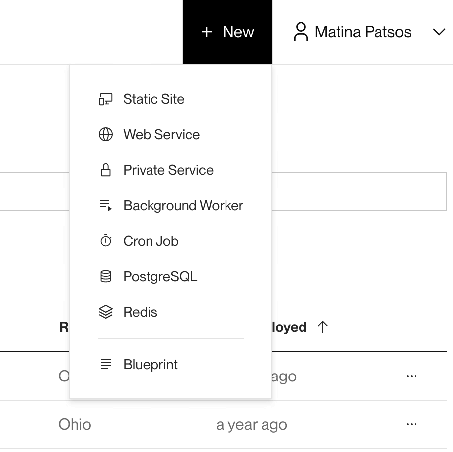
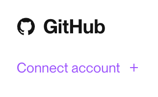
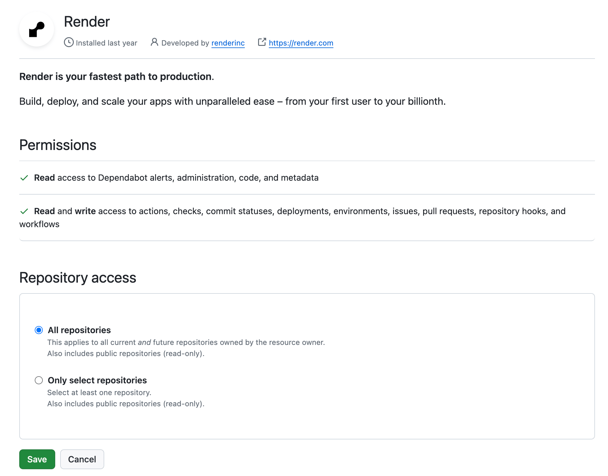
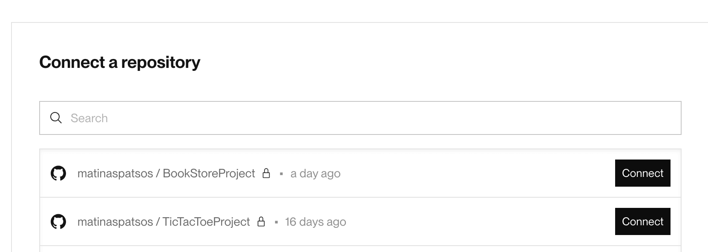
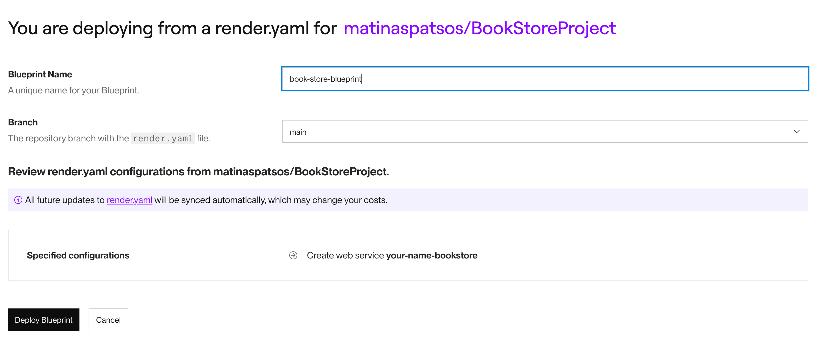
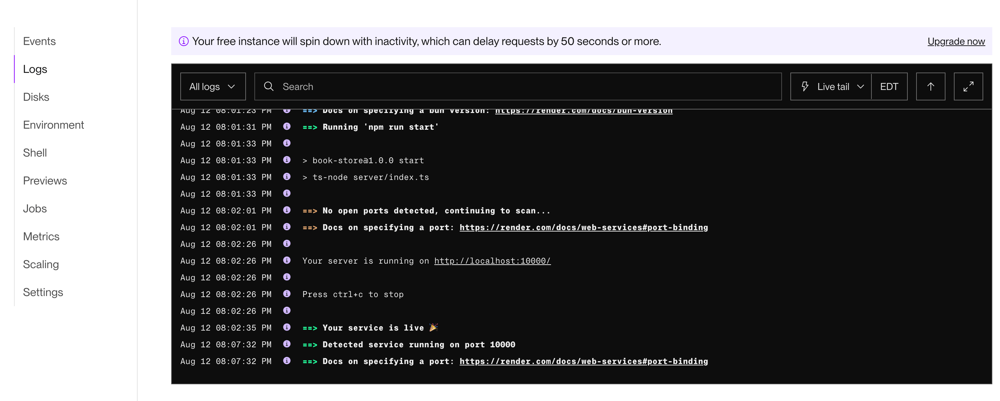
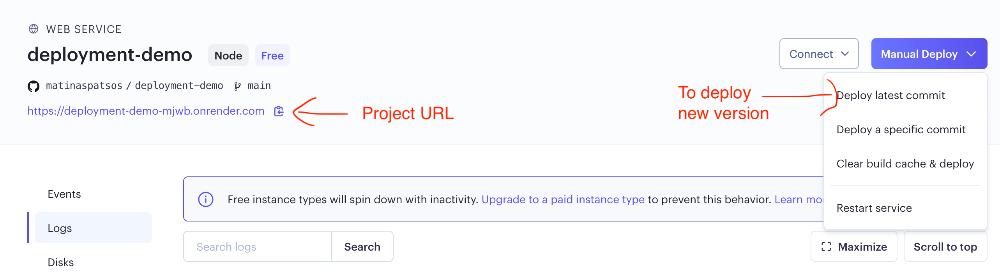

# Deploying to Render.com

Render.com is a website for hosting full stack applications. Render.com has a free tier, (but the catch is that your app have a cold start of one minute). This is a guide for how to deploy your final project to Render.com.

## Before deploying

Before getting starting, open up the _render.yaml_ file. This file configures your app's URL, build command, start command, and environment variables.

```yaml
services:
  - type: web
    # Update name below
    # This sets the URL to "______.onrender.com".
    # It must be unique between all Render.com users.
    name: your-name-bookstore
    # ...
    envVars:
      - key: NODE_VERSION
        # Update the line below to your current version of node
        # To get your node version: node -v
        value: 20.13
        # ...
```

Update the name of your app. This will be your apps URL. So if you change it to "janedoe-bookstore", then your project's URL will be _https://janedoe-bookstore.render.com_.

You will also want to update the node version. To get your current version of node, run the command `node -v`. Replace the value _20.13_ in your _render.yml_ file with you current node version.

Finally, create an account. Visit [Render's website](https://render.com/) and click on the "Get Started" button. Proceed to create an account. I suggest you create an account with GitHub, because we are going to use it in the next steps.

## Deploy your project to Render.com for the first time

1. Visit [Render's website](https://render.com/) and login if needed.
2. Click on "Dashboard" in the navbar on the top of your screen.
3. On the top right, click on the "New" button and select "Blueprint"



4. You should see the "Create a new Web Service" page. In the sidebar on the right, click on "Connect Account" underneath GitHub. You may be asked to login to your GitHub account.



5. Underneath "Install Render" screen, I recommend that you choose "All repositories". You can select a single repository, but it will you need to change this if you want to host another project later. Scroll down and click either "Save" or "Install".



6. You should return to the "Connect a repository" screen and you should see your project in a list of GitHub repositories. Click on the "Connect" button next your final project.



8. Enter a name for your blueprint. For example, "book-store-blueprint". Then click on "Deploy Blueprint".



9. Your app will take a few minutes to deploy. When you see "Your service is live", the deployment is complete. To see the app's progress in real time, click on "Create web service your-name-bookstore" and then click on "Logs" in the sidebar.



You can find the URL inside of the project's dashboard. If you want a custom URL, you will have to register a domain with a DNS service separately. See https://render.com/docs/custom-domains



## Deploying updates to your project

Commit your latest code changes and push to the main branch with `git push origin main`. This should automatically deploy updates to your apps. However, if this fails or if you need to manually deploy your project:

1. Go to your Render.com Dashboard and select your project.
2. Click on "Events" in the sidebar.
3. If your project isn't deploying already, click on the "Manual Deploy" button and select "Deploy latest commit".
