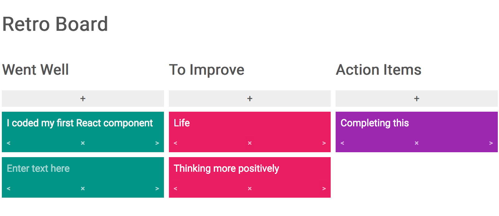
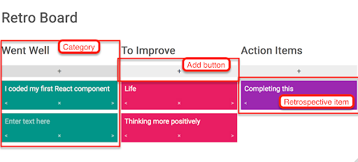

# Project 1: Retro Board

**Due July 29, 2024 End of Day**

For your first project, you will be creating a retrospective board. A retrospective board is used within the Scrum workflow. Scrum is the most popular Agile style of software project management used to guide the software development life cycle. Scrum style management is based on four basic ceremonies for each sprint or software release: the 1.) Sprint Planning meeting, 2.) Daily Stand-up, 3.) Sprint Review, and 4.) Sprint Retrospective. As a part of the Sprint Retrospective, team members will use a retrospective board to reflect on what went well and what they need to improve on for next time.

This project is inspired by _GoRetro_. If you are not familiar with a retrospective board, please [visit the GoRetro website](https://www.goretro.ai/) and create a new board.



## Project Goals

- To put together and make practical use of what was taught in class.
- To learn about developer practices, like setting up an application, maintaining your own git repository and writing a _README.md_.
- To build a portfolio piece to show off to potential employers.

This project will bring together these topics covered in class:

- React Components
- Props
- State
- Events in React
- Forms in React
- Lifting State Up

## Getting Started

You first want to create a new React project with Vite.js. Put it somewhere you will remember it. It should be outside of the class repository. Open your terminal or Git Bash:

```shell
# For example, if you want to put this in your "Documents" folder:
cd ~/Documents

# Install Vite.js and React
npm create vite@latest
# Project name: retro-board
# Select a framework: React
# Select a variant: JavaScript

cd retro-board/
npm install
```

You will need to [create a new public Github repository](https://help.github.com/en/articles/create-a-repo) for this project. It must be public. Skip adding a _README.md_, _.gitignore_ and license file. (You already created these with Vite.js).

When you get to this page:


Copy the instructions under "…or push an existing repository from the command line" and paste them in your terminal.

## Project Requirements

Your retrospective board must meet all the following application setup, UI and coding requirements.

### Application Setup Requirements

- You must create a git repository for the application and it must be hosted publicly on Github.
- Your application should be easy to install and start. **IF WE CANNOT INSTALL OR START YOUR APPLICATION, IT IS AN AUTOMATIC FAILURE.**

Note that we will go over setting up the project in class.

### UI Requirements



- The Retro Board should have three categories: 1.) "Went Well" 2.) "To Improve" and 3.) "Action Items". The categories must be displayed in this order. They must be arranged in such a way that the user can easily tell what UI elements on the page belong to what category.

- Each category should contain an add button or another type of UI element. When clicked or activated, the application will add a new retrospective item to the given category.

- The user should be able to type text inside of each retrospective item. This text will be stored in state. The only time the text can change is when the user is typing inside the retrospective item.

- The user should be able to delete each retrospective item. When deleted, the retrospective item should be removed from state and the application.

- The user should be able to move the retrospective item into a different category by clicking on a left or right arrow. If there is not a category to the left, then clicking the arrow should move the retrospective item to the rightmost category. The same applies to if there is no category to the right but in reverse. When the item moves from one category to the next, the retrospective item’s user input, visual structure, and appearance (with the exception of color) should stay the same.

- For the final UI requirement, you must pick one of the following:

  - Add a “like” and “dislike” button (or other clickable UI elements) to your retrospective items. Clicking on one of these buttons should change the number of votes for likes (and, optionally, dislikes). Display the number of votes in each retrospective item.
  - Validate user input. Make text within the retrospective item required. When the retrospective item loses focus or is submitted (the type of event will depend on how you design the functionality of your application), the text should be validated in some way. Suggestions are to remove the retrospective item from the board or display an error message.
  - Add functionality to change the layout of the retrospective board. Include some type “layout switcher” UI element(s). When clicked or activated, the layout of the categories will change between a horizontal and vertical layout.  
    

- Your project should not have any major bugs.

**It is not required, but it is highly recommended that you lift state up.**

### Coding Requirements

- This application should contain at least two React components.
- One component should pass `props` into another component.
- One (or more) of your React components should handle state. Apply `useState()` hooks and update state correctly with functions returned from `useState()`.
- The application should handle events correctly within React components.
- Styling must be included, but you will not be graded on how visually appealing your application is or how well your CSS is written.

## Project Design

We realize that we did not teach design in this class, but there is no way to get around the fact that design must be a part of the process. We will not grade your project on how good it looks, but a good design will make a better impression with employers, so please try to make your application look as nice as possible.

An example HTML and CSS file can be found inside of _projects/retro-board/examples_. In my example, I used icons images from [Font Awesome](https://fontawesome.com/start). You can use some or all of the example code. You will need to refactor the HTML into JSX.

## Tips

It is highly recommended that you lift state up.

Work on these two things first before diving in:

1. Rendering static, nonfunctional JSX with dummy data
2. Designing your data model (what your state will look like and how you will modify state). You may find it helpful to design your state in isolation first.

If you find using more than one component challenging, begin with a single component. Then break your component down into separate components later.

When looping through an array, you may find it helpful to use placeholder data first before using real data.

With your event handlers and callbacks, you want to log values and any arguments first before modifying state e.g. `console.log(e.target.value)`. This way, you know whether or not your code is working.

If you need to loop through an object inside JSX, convert it into an array with `Object.values()`, `Object.keys()` or `Object.entries()`.

Flexbox, CSS grids, and other types of CSS layouts often require that you maintain parent-child relationships in order to work. If you find that your layout is breaking, it could be because your are rendering an extra set of `<div>` tags between what is expected to be the parent and what is expected to be the child. This gotcha typically happens when one React component includes another or when you loop through an array. When this happens, try replacing unnecessary `<div> ... </div>` tags with React fragments (`<> ... </>`).

Consider using `<textarea>` for user input instead of `<input type="text">`.

## Code Quality

While your grade is not determined on whether or not you follow these code quality tips, we encourage you to code to a professional standard. One of the goals of this project is to help you build a portfolio. Just like an interviewer will judge you on your attire, employers will judge you on the neatness of your code.

- You should have _README.md_ written in Markdown. It should explain the purpose of the project, give instructions on how to install and start your project, and credit yourself as the author. Here are some resources on creating _README.md_ files:
  - [Make a README](https://www.makeareadme.com/)
  - [Markdown cheatsheet](https://github.com/adam-p/markdown-here/wiki/Markdown-Cheatsheet)
- Add anything that should not be committed to your _.gitigore_ file. Your "node_modules" folder should be ignored.
- Choose descriptive and specific names for React components, constants, functions and anything else that is named.
- You must not leave any debugging statements in your code. Remove any `console.log()` statements from your code before committing.
- Only have actual comments within comment tags. Do not commit code that you commented out for debugging purposes.
- No errors should appear in the console.
- Remove any components or code that is not being used. (This affects application load time as well as code quality.)
- Use proper indentation. (Prettier can take care of this.)

## Github Repository

You will need to [create a new public Github repository](https://help.github.com/en/articles/create-a-repo) for this project. It must be public. You should also include a _README.md_ and _.gitignore_ file.

Your _README.md_ file should be written in [Markdown](https://github.com/adam-p/markdown-here/wiki/Markdown-Cheatsheet). This should be written for employers who may be looking at your work. Describe your project and explain how to get started. You can find an example template of a _README.MD_ here:
https://github.com/othneildrew/Best-README-Template

## Project Help

Your instructors are will provide one hour per week to help you with your projects. Please reach out to them at least one day in advance. You can contact them on Teams or email them.

## Project Submission

The initial deadline for the project is July 29. You will submit your project by emailing Jamal (jamal@albanycancode.org) and Matina (matina@albanycancode.org) a link to your project repository on Github. Your project does not have to be 100% complete, but try to complete as much as you can.

CanCode Communities may host your project in a public space and they may be sharing your work with employers.

### Project Resubmission

You may resubmit this project again for a better grade. In order to resubmit, you must have made a valid attempt. (That is, you must have your project setup, your project must be hosted in Github, your application must start and your project must meet some of the requirements).

A part of this project is building a portfolio piece. Your instructors may ask you to resubmit the project if there are any major or obvious bugs. They may also suggest that you resubmit if the UI is confusing or is not delivering an adequate user experience.

You have until the last day of class to resubmit your project.

### Extensions

We know that life is unpredictable and sometimes serious, unexpected circumstances may prevent you from completing your work. We are willing to be flexible in these cases. Please contact the program director and your instructors _as soon as possible_ to get an extension.
